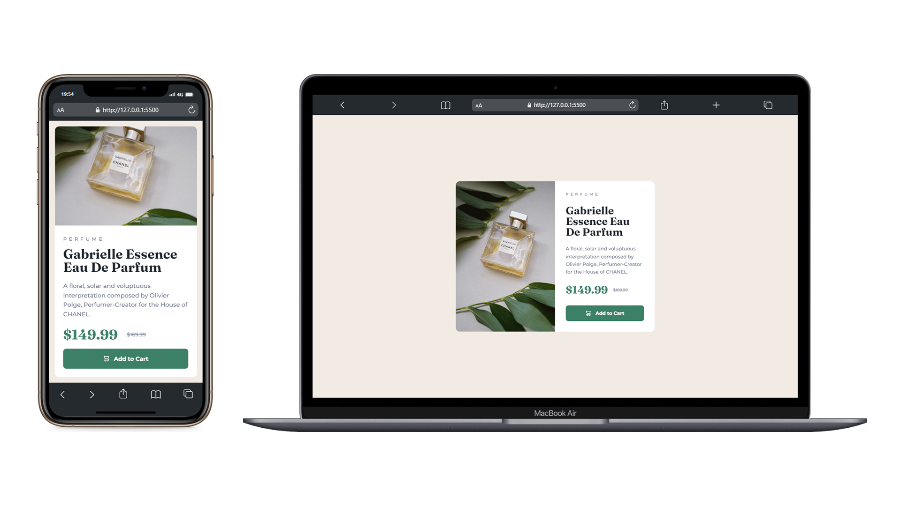

# ✅ Frontend Mentor: Product Preview Card Component

Hello everybody! 😊

🚶‍♂️ I just completed the [Frontend Mentor's product preview card component challenge](https://www.frontendmentor.io/challenges/product-preview-card-component-GO7UmttRfa)! These challenges are fantastic for enhancing your coding skills through hands-on experience with real-world projects.

## 🗿 Overview

### 📷 Screenshots



🏆 I am happy that I made a fully responsive design, even though it was a little tiring process, I think it turned out a nice design as a result, what do you think?

### 🔗 Links

- CodeSandbox URL: [https://553vgx.csb.app](https://553vgx.csb.app)
- Live Site URL: [https://frontend-mentor-product-card-seven.vercel.app/](https://frontend-mentor-product-card-seven.vercel.app/)

## 🚀 My process

### ⚡ Built with

- Semantic HTML5 markup
- CSS custom properties
- Flexbox
- Grid
- Mobile-friendly full responsive.

### 👾 What I learned

In this challenge, I learned the CSS grid structure and CSS flex structure by reinforcing it well. I tried to get a proper result by experimenting as much as possible. It was a good study for me to understand the media query structure better. I learned that SVG tags, especially, do not take width and height values. Through some research, I found the transform: scale property.

CSS Code Snippet:

```css
footer button > svg {
  transform: scale(0.9);
}
```

### 💪 Continued development

For front-end developers, the learning process never ends. For this reason, I want to improve myself as much as possible in HTML and CSS. Then I want to complete my development with JS and React.js, discover new CSS libraries and improve myself in every aspect of the field as much as possible.

## 🚩 Author

- Frontend Mentor - [@yavuzkarakus](https://www.frontendmentor.io/profile/yavuzkarakus)

## 📒 Notes

🚶‍♂️ I plan to continue these challenges as long as I can. If you are interested in these topics, don't forget to tune in and follow me.

⭐ If you liked this project and the challenge, please don't forget to star it.
